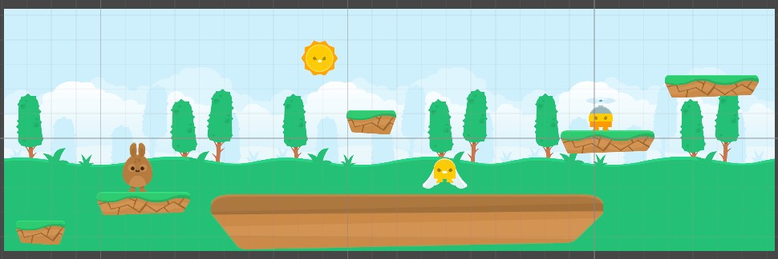

### Задание №1:

Создать новый проект игры платформер, используя дополнительный материал к домашнему заданию. Грамотно организовать все папки 
проекта, организовать структуру проекта. Построить карту игры - расположить все элементы окружения, главного героя.

